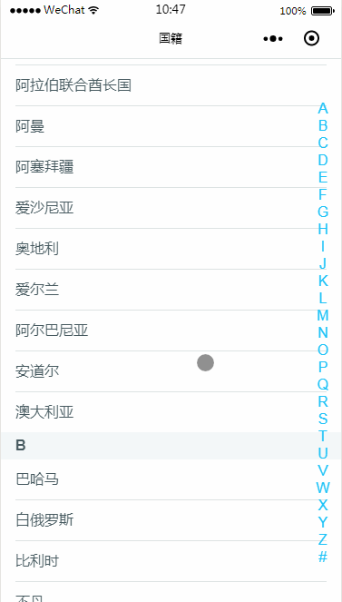
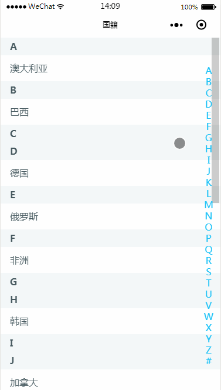

### wxaSortPicker

* 版本号`1.0.1`
* github地址: [https://github.com/nickrogit/wxaSortPicker](https://github.com/nickrogit/wxaSortPicker)
* 说明：小程序首字母排序选择器，网上有不少但觉得不太好，自己优化改进的这款觉得还不错，后面再慢慢完善丰富。

### 版本说明

* 1.0.0版本仅支持字符串数组
* 1.0.1版本加入json数组支持，如：[{name:'中国',value:'China'},{name:'美国',value:'America'}]，value取值e.target.dataset.value，其他不变


### 功能

* 字符串数组首字母排序
* 右侧点击字母定位
* 点击item返回数据

### 开发要点

* 解析汉字Unicode编码并排序
* 小程序scroll-view组件的scroll-into-view属性，点击右侧字母改变scroll-into-view的属性值，定位。
* scroll-into-view（值应为某子元素id（id不能以数字开头）。设置哪个方向可滚动，则在哪个方向滚动到该元素），


### 适用场景

 * 城市、国籍、通讯录等字母排序
 
## 功能预览






## 使用方式

* 引入相关文件并初始化，详情参看pages/index/index

```
var wxaSortPicker = require('../../utils/wxaSortPicker/wxaSortPicker.js');
onLoad: function () {
    var that = this
    //初始化
    /*wxaSortPicker.init([
			"澳大利亚", "阿富汗", "巴哈马", "白俄罗斯", "比利时", "不丹", "巴西", "柬埔寨", "丹麦", "多米尼加","中国","蒙古","朝鲜","韩国","日本", "菲律宾","越南","老挝","缅甸","泰国","马来西亚","文莱","新加坡","印度尼西亚","东帝汶","尼泊尔","不丹","孟加拉国","印度","巴基斯坦","斯里兰卡","马尔代夫","哈萨克斯坦","吉尔吉斯斯坦","塔吉克斯坦","乌兹别克斯坦","土库曼斯坦","阿富汗","伊拉克","伊朗","叙利亚","约旦","黎巴嫩","以色列","巴勒斯坦","沙特阿拉伯","巴林","卡塔尔","科威特","阿拉伯联合酋长国","阿曼","也门","格鲁吉亚","亚美尼亚","阿塞拜疆","土耳其","塞浦路斯","芬兰","瑞典","挪威","冰岛","丹麦" ,"法罗群岛","爱沙尼亚","拉脱维亚","立陶宛","白俄罗斯","俄罗斯","乌克兰","摩尔多瓦","波兰","捷克","斯洛伐克","匈牙利","德国","奥地利","瑞士","列支敦士登","英国","爱尔兰","荷兰","比利时","卢森堡","法国","摩纳哥","罗马尼亚","保加利亚","塞尔维亚","马其顿","阿尔巴尼亚","希腊","斯洛文尼亚","克罗地亚","黑山","马耳他","波斯尼亚和黑塞哥维那", "意大利", "梵蒂冈", "圣马力诺", "西班牙", "葡萄牙", "安道尔", "直布罗陀", "哥斯达黎加", "巴拿马","加拿大","美国","墨西哥","格陵兰","圣皮埃尔和密克隆","危地马拉","伯利兹","萨尔瓦多","洪都拉斯","尼加拉瓜","澳大利亚","新西兰"
		], that);*/

    wxaSortPicker.init([
      { name: '中国', value: 'China'},
      { name: '俄罗斯', value: 'Russia' },
      { name: '美国', value: 'America' },
      { name: '澳大利亚', value: 'Australia' },
      { name: '巴西', value: 'Brazil' },
      { name: '韩国', value: 'Korea' },
      { name: '朝鲜', value: 'North Korea' },
      { name: '英国', value: 'Britain' },
      { name: '德国', value: 'Germany' },
      { name: '加拿大', value: 'Canada' },
      { name: '非洲', value: 'New Zealand' },
    ], that);
  },

  //选中返回值
  wxaSortPickerItemTap: function(e){
    console.log(e.target.dataset.text);
    console.log(e.target.dataset.value);//字符串数组无此字段
  }
```

